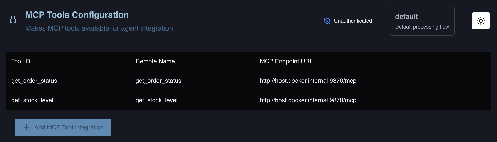
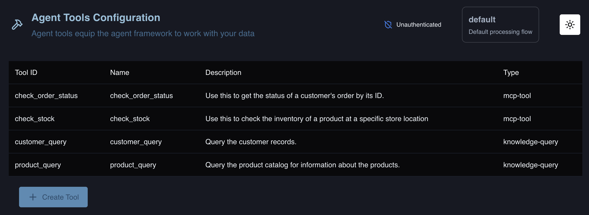

# Retail Agentic MCP Demo

This demo simulates an architecture that would be representative of a retail store that has both online orders and fulfillment in additional to in-store inventory. The demo includes:
- Customer records as a knowledge graph
- Product Catalog as a knowledge graph
- MCP server for order status
- MCP server for store inventory
- Agentic Tools configuration

## Deploy TrustGraph

Begin with a [TrustGraph deployment](https://docs.trustgraph.ai/deployment/) of your choice.

## Download the Files

You can either `clone` this repo or download the 4 necessary demo files. The files are:
```
customers.ttl
products.ttl
retail_MCP_setup.sh
retail_MCP_server.py
```

## Using the Included TrustGraph Config

A configuation of TrustGraph is included in the `trustgraph_config` folder. It uses `Mistral Medium 3.1` and `Docker`. If you would like to use this configuration begin by cloning the repo or downloading the files:

> [!NOTE]
> The Docker Engine must be running prior to launching TrustGraph. If it is your first time launching TrustGraph, the Docker Engine will need to pull all of the containers from the Docker Hub.

```
cd trustgraph_config
export MISTRAL_TOKEN=<your-mistral-token>
pip3 install trustgraph-cli==1.2.17
docker compose up -d
```

## Launch the MCP Server

Once TrustGraph is fully running, launch the MCP server. It first may be necessary to install the MCP python library.
```python
pip3 install mcp
```

To launch the MCP server:
```
python3 retail_MCP_server.py
```

You will need to leave the MCP server terminal window open. Open a new terminal window to continue configuration.

## Configure the MCP and Agent Tools

The MCP and Agent tools can be configured manually through the Workbench. However, there is a script that will configure all tools automatically. To launch the script:
```bash
bash retail_MCP_setup.sh
```

Under `MCP Tools` you should see:



Under `Agent Tools` you should see:



## Test the Agent

The Agentic flow can be used from the `Agent` chat in the Workbench or the CLI. Below is a question that will test all aspects of the demo:
```
I'm Alice Johnson. My order ID is ORD-99887. Can you check my order status, contents, arrival date, address, and email address on file? I also need a 'NordicWave Comfort 20' sleeping bag. Is it in stock in Denver? And what headlamp would you recommend as an accessory for the 'TrailSeeker Pro' tent?
```

With the CLI:
```bash
tg-invoke-agent -v -q "I'm Alice Johnson. My order ID is ORD-99887. Can you check my order status, contents, arrival date, address, and email address on file? I also need a 'NordicWave Comfort 20' sleeping bag. Is it in stock in Denver? And what headlamp would you recommend as an accessory for the 'TrailSeeker Pro' tent?"
```

## Data Access Controls

During the load process, the customers records are added to a `customers` collection, and the product catalog is loaded to a `products` collection. The tools that queries for this information are limited to each individual collection. For instance, if you were to delete the `customer_query` agent tool, the agentic flow will no longer have access to the customer records in the `customers.ttl` file. If you re-run the test prompt, you will see a different response, as the agent can no longer find the customer's personal information.
